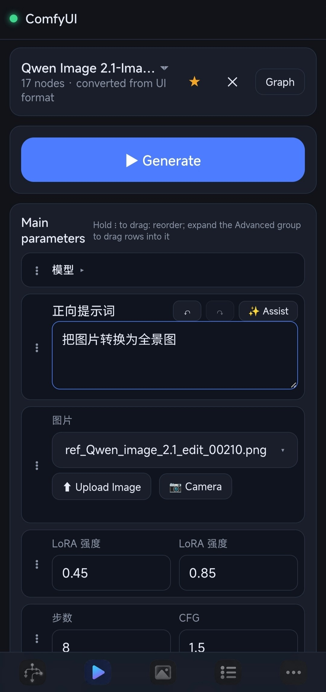
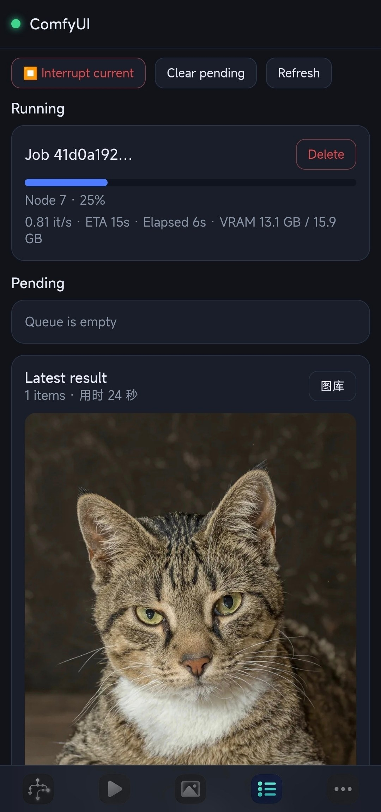
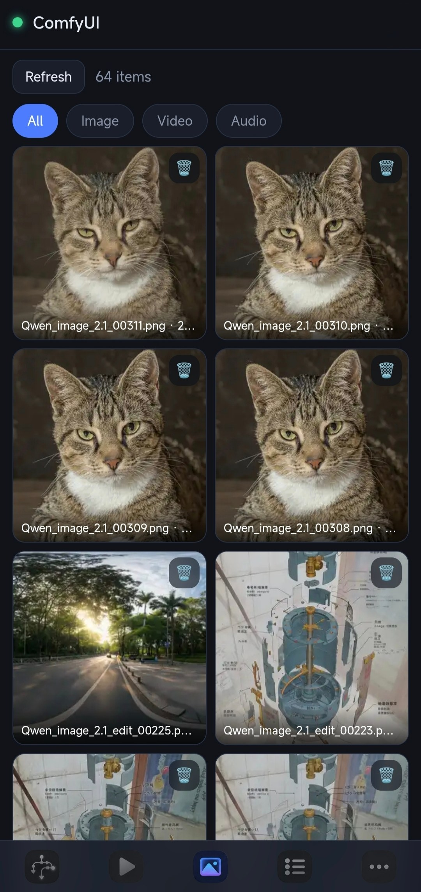
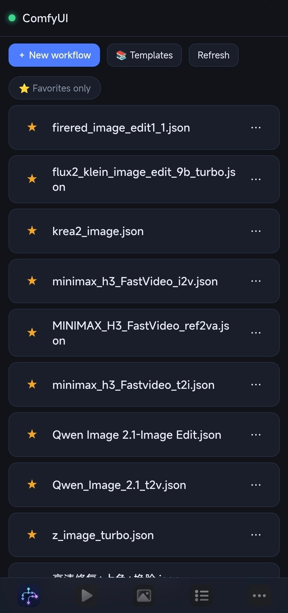
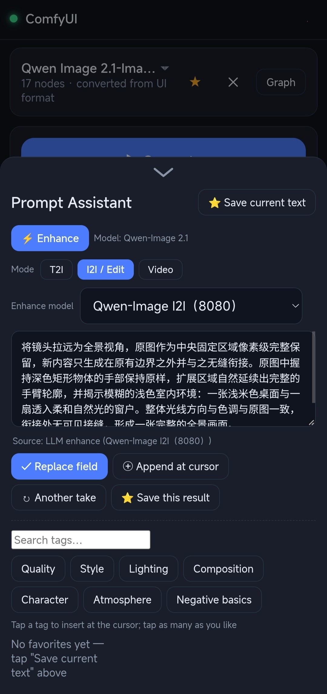
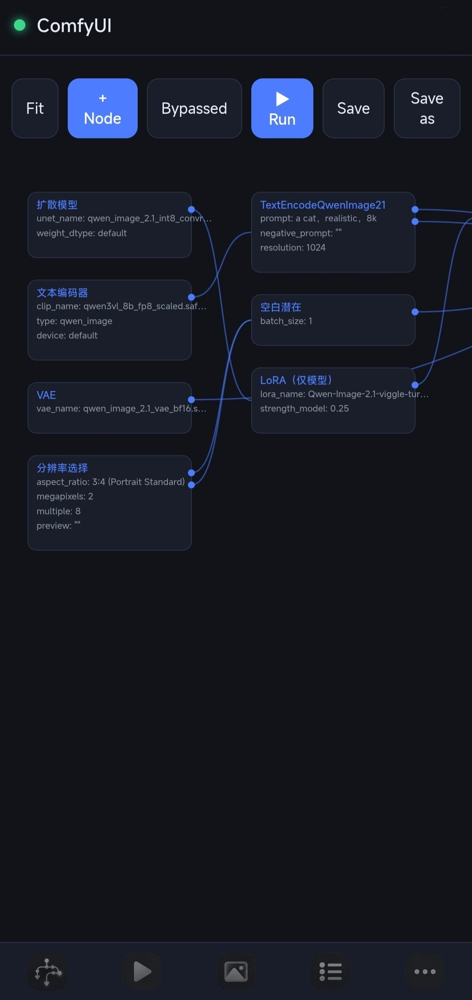
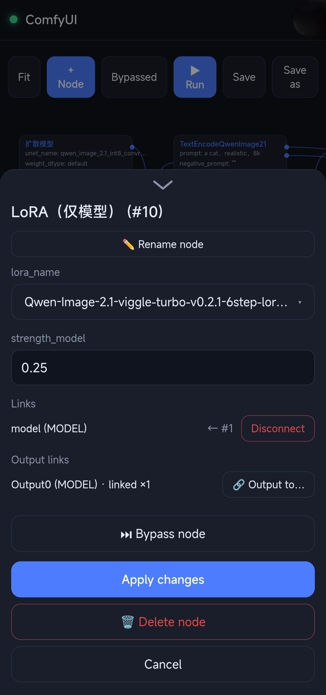
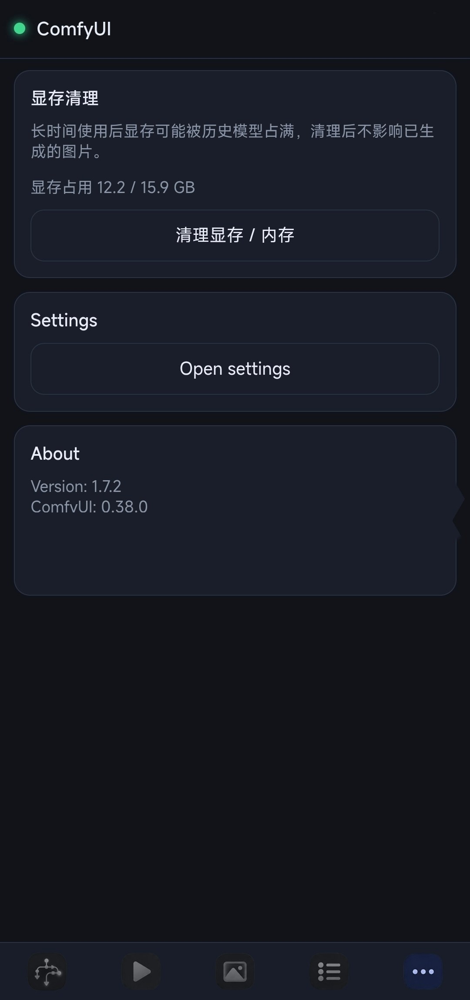

# ComfyUI Mobile

**中文** | [English](#english)

[](LICENSE)


把电脑上的 **ComfyUI** 装进手机浏览器：电脑运行一个轻量**安全网关**，手机打开网页就是一个为竖屏重新设计的完整操作界面——工作流管理、参数表单、实时进度、图库、队列、节点图、模型浏览，并支持「添加到主屏幕」安装为 PWA。

## ✨ 功能特色

- **📱 为竖屏而生**：不是把桌面页面缩小，而是重排成大按钮、单手可操作的移动布局；支持同时打开多个工作流，下拉切换
- **⚡ 快速运行表单**：自动把工作流推导成手机友好的参数表单（提示词 / 图片 / 比例分辨率 / 步数·CFG / 种子·去噪 / 采样器 / 模型），参数行可拖动排序、移入「高级」区并自动记忆；校验报错可一键修复
- **🗂️ 工作流管理**：列表、新建、重命名、下载、删除；自动把 ComfyUI 导出的 UI 格式（含子图、旁路、动态组合等新特性）转换为可执行的 API 格式
- **📚 模板库**：内置 ComfyUI 官方模板和 23 个常见节点包的示例工作流，一键另存即可使用；官方模板带「本地 / 云端 API」标识，可按类型筛选，打开云端模板会提醒消耗积分
- **🖼️ 图库**：历史结果瀑布流，图片 / 视频 / 音频分类浏览，视频首帧缩略图；保存到手机、分享、**用原参数一键重跑**；缩略图由网关本地生成 + 浏览器缓存，二次打开几乎不耗流量
- **📊 队列**：实时进度、生成速度（步/秒）、显存占用、中途预览图；删除 / 清空 / 中断
- **🧩 节点图**：在手机上直接编辑节点图——添加 / 连线 / 删除 / 重命名节点、点按修改参数
- **🔌 一键隧道**：内置 Tailscale 与 cloudflared 支持，一条命令获得外网可访问的地址（见「手机连接」）
- **🖥️ 远程唤醒**：ComfyUI 没开也能在手机上远程启动 / 重启电脑端的 ComfyUI
- **🔐 开箱即用的安全**：访问令牌、防爆破封禁、写操作限流、路径穿越校验，详见「安全设计」
- **🌍 双语界面**：中文 / English 随时切换

## 📱 界面一览

<table>
  <tr>
    <td align="center"><br>运行页：工作流自动推导成参数表单，点「生成」即出图</td>
    <td align="center"><br>队列：实时进度、步速与显存占用，随时中断</td>
    <td align="center"><br>图库：历史结果分类浏览，保存 / 分享 / 一键重跑</td>
  </tr>
  <tr>
    <td align="center"><br>工作流：新建、收藏、模板库一键直达</td>
    <td align="center"><br>提示词助手：LLM 一键润色，标签即点即插</td>
    <td align="center"><br>节点图：手机上直接查看与调整连线</td>
  </tr>
  <tr>
    <td align="center"><br>节点编辑：点按节点改参数、旁路或删除</td>
    <td align="center"><br>更多：显存清理、设置与版本信息</td>
    <td></td>
  </tr>
</table>

## 🚀 快速开始

> 前提：电脑上已有一套能正常运行的 ComfyUI（浏览器能打开 `http://127.0.0.1:8188` 即可；实测版本 0.37.0，兼容新旧两种接口路径），以及 Node.js ≥ 20。

**1️⃣ 电脑端安装并启动网关**

```sh
# 获取本仓库（git clone 或直接 Download ZIP）后：
cd comfyui-mobile
npm install
npm start        # 默认对接本机 8188 端口的 ComfyUI
```

首次启动会自动生成配置文件 `server/config.json`（含随机访问令牌），并在终端打印**二维码**和一整行可直接复制的连接地址。

**2️⃣ 开启外网访问（可选，推荐）**

```sh
node server/src/index.js --tunnel=funnel
```

不用 Tailscale？cloudflared 快速隧道免账号即开即用：`--tunnel=quick`。全部方式见下方「手机连接」。

> Windows 也可以直接双击 `启动.bat`。

**3️⃣ 手机连接**

- **家里（同一 WiFi）**：扫终端里的二维码，或打开配对链接，自动登录。
- **外面（手机流量 / 其他 WiFi）**：按需选择一种地址——

| 方式 | 启动参数 | 地址 | 手机需要 | 说明 |
| --- | --- | --- | --- | --- |
| Tailscale Funnel | `--tunnel=funnel` | ✅ 永久 | 什么都不用装 | 公网可访问；流量经 Tailscale 中继，**较慢**，不太适合传大图 |
| **Tailscale Serve（推荐）** | `--tunnel=serve` | ✅ 永久 | 装 Tailscale 并保持在线 | 仅 tailnet 内可达；点对点直连**最快**，且不暴露公网 |
| cloudflared 快速隧道 | `--tunnel=quick` | ❌ 每次重启变 | 什么都不用装 | 免账号免域名，适合临时试用 |
| cloudflared 命名隧道 | `--tunnel=named` | ✅ 永久 | 什么都不用装 | 需要托管在 Cloudflare 的自己的域名 |
| frp / 路由器端口转发 | — | 取决于配置 | 取决于配置 | 端口转发必须给网关配置 TLS |

cloudflared 单文件可从[官方 Releases](https://github.com/cloudflare/cloudflared/releases/latest/download/cloudflared-windows-amd64.exe) 下载，放到项目根目录即可被自动发现。

**4️⃣ 安装为 App（可选）**

手机浏览器菜单选「添加到主屏幕」，即可像原生 App 一样全屏使用（PWA）。

## ⚙️ 进阶配置

### 命令行参数

```sh
node server/src/index.js --port=8899 --upstream=http://127.0.0.1:8188 --token=<你的令牌> --tunnel=true
```

### 配置文件 `server/config.json`（首次启动自动生成）

```json
{
  "port": 8899,
  "upstream": "http://127.0.0.1:8188",
  "token": "<64 位随机 hex>",
  "tls": { "cert": "", "key": "" },
  "maxUploadMB": 512,
  "rateLimitPerMin": 120,
  "outputDir": "",
  "inputDir": "",
  "thumbCacheDir": "",
  "tunnel": "funnel",
  "tailscaleHttpsPort": 8443,
  "cloudflared": "",
  "comfyuiLaunch": "",
  "comfyuiCwd": ""
}
```

### 手机远程启动 ComfyUI

在 `server/config.json` 里配置本机 ComfyUI 的启动命令（该文件不入库）：

```json
{
  "comfyuiLaunch": "C:\\ComfyUI\\run_nvidia_gpu.bat",
  "comfyuiCwd": "C:\\ComfyUI"
}
```

之后手机端「设置 → 服务器」会出现常驻按钮：ComfyUI 未运行时是 **「启动 ComfyUI」**，一键远程拉起（冷启动约 1–3 分钟，页面会轮询并提示就绪）；运行中时变为 **「重启 ComfyUI」**，用于卡死救急（会结束占用 ComfyUI 端口的进程树后重新拉起）。两个操作都会弹确认框，重启会中断正在生成的任务。配套地，**令牌正确但 ComfyUI 未运行时也允许登录**，并引导去设置页远程启动。

> 安全模型：启动命令只来自本机配置文件，任何网络请求都无法指定「启动什么」；未配置时接口直接拒绝、按钮不显示。运行日志在 `logs/comfyui.log`。留空（默认）即完全关闭此功能。

### 开机自启（Windows，可选）

双击 `scripts/install-autostart.bat`（卸载用 `uninstall-autostart.bat`），会创建两个**用户级**计划任务（无需管理员、不存密码）：一个登录时启动网关，一个每 5 分钟检查并自动拉起崩溃的网关。日志写入 `logs/gateway.log`。Linux / macOS 可用 systemd / launchd 自行配置。

## 🔒 安全设计

- 所有 API 与 WebSocket 均需访问令牌（Bearer / Cookie / 查询参数三种通道），鉴权失败触发防爆破封禁
- 写操作限流（默认 120 次/分钟）
- `/view`、`/userdata` 均有路径穿越校验
- 远程启动只能执行配置文件里写死的那条本机命令，无法被用来执行任意命令
- ComfyUI 本身保持只监听本机（127.0.0.1）；网关支持自带 TLS 证书（`config.json` 的 `tls` 字段），端口转发场景必须配置

## ❓ 常见问题

**手机上需要装什么吗？**
不用，任何现代浏览器都可以；「添加到主屏幕」后体验更像 App。

**电脑重启后地址会变吗？**
用 `--tunnel=funnel`（公网永久）或 `--tunnel=serve`（tailnet 永久）地址就不变。但注意：地址永久 ≠ 服务永久——网关和 ComfyUI 得在电脑上运行着，关机后访问会看到错误页，重新启动即恢复。

**支持 Linux / macOS 吗？**
网关是纯 Node.js、手机端是纯网页，本身不挑平台；Linux / macOS 用 `start.sh` 启动即可。不过文档、`启动.bat` 和开机自启脚本以 **Windows 实测**为准，其他平台的开机自启需自行配置。

**暴露到公网安全吗？**
见「安全设计」。最稳妥的路径是不暴露公网的 Tailscale Serve；若使用公网隧道，建议保持默认令牌强度并开启限流。

## 🛠️ 开发与测试

```sh
npm test        # 单元 + 集成测试：内置模拟 ComfyUI，离线可跑
npm run mock    # 单独启动模拟 ComfyUI（默认 :8189），用于联调
```

架构设计、API 映射、安全设计等开发文档见 [docs/DEVELOPMENT.md](docs/DEVELOPMENT.md)（中文）。

```
server/   网关（Node ESM：鉴权 / 反向代理 / WebSocket 代理 / 静态文件 / 限流 / 一键隧道）
web/      移动端 PWA（无构建步骤：原生 ES Module + 手写 Service Worker）
scripts/  模拟 ComfyUI、图标生成、开机自启安装/卸载等辅助脚本
docs/     开发文档
```

## 📄 许可证

本项目以 [MIT](LICENSE) 协议开源。

---

## English

[中文](#comfyui-mobile) | **English**

Put the **ComfyUI** on your desktop into your phone's browser: the PC runs a lightweight **secure gateway**, and the phone gets a full UI redesigned for portrait screens — workflow management, parameter forms, live progress, gallery, queue, node graph, and model browser. Installable as a PWA via "Add to Home Screen".

## ✨ Features

- **📱 Built for portrait screens** — not a shrunken desktop page but a proper mobile layout with large, one-hand-friendly controls; multiple workflows open at once with a dropdown switcher
- **⚡ Quick-run form** — the workflow is automatically turned into a phone-friendly parameter form (prompts / images / aspect & resolution / steps·CFG / seed·denoise / sampler / model); parameter rows are draggable (reorder, move to the "advanced" section) and remembered; validation errors offer one-click fixes
- **🗂️ Workflow management** — list, create, rename, download, delete; ComfyUI's exported UI format (including subgraphs, bypass, dynamic combos and other new features) is automatically converted into an executable API format
- **📚 Template gallery** — ships with official ComfyUI templates plus sample workflows from 23 popular node packs, ready to save and run; official templates carry a Local / Cloud API badge with a type filter, and opening a cloud template warns about credit usage
- **🖼️ Gallery** — a waterfall of past results with image / video / audio filters and video first-frame thumbnails; save to phone, share, or **rerun with the original parameters**; thumbnails are generated locally by the gateway and cached by the browser, so re-opening costs almost no data
- **📊 Queue** — live progress, speed (steps/s), VRAM usage and in-flight previews; delete / clear / interrupt
- **🧩 Node graph** — edit node graphs on the phone: add / wire / delete / rename nodes, tap to change parameters
- **🔌 One-click tunnels** — built-in Tailscale and cloudflared support; one command gets you a shareable public address (see "Connect your phone")
- **🖥️ Remote wake-up** — start or restart ComfyUI on the PC remotely, even when it isn't running
- **🔐 Secure by default** — access token, brute-force bans, write rate limiting and path-traversal checks (see "Security")
- **🌍 Bilingual UI** — Chinese / English, switchable any time

## 📱 Screenshots

<table>
  <tr>
    <td align="center"><br>Run — the workflow becomes a parameter form; tap "Generate"</td>
    <td align="center"><br>Queue — live progress, speed and VRAM; interrupt anytime</td>
    <td align="center"><br>Gallery — past results by type: save / share / rerun</td>
  </tr>
  <tr>
    <td align="center"><br>Workflows — create, favorite, or start from templates</td>
    <td align="center"><br>Prompt Assistant — one-tap LLM enhancement plus quick tags</td>
    <td align="center"><br>Node graph — view and rewire the graph on the phone</td>
  </tr>
  <tr>
    <td align="center"><br>Node editor — tap a node to edit params, bypass or delete</td>
    <td align="center"><br>More — VRAM cleanup, settings and version info</td>
    <td></td>
  </tr>
</table>

## 🚀 Quick Start

> Prerequisites: a working ComfyUI on the PC (you can open `http://127.0.0.1:8188` in its browser; tested against 0.37.0, compatible with both new and legacy endpoint paths) and Node.js ≥ 20.

**1️⃣ Install and start the gateway**

```sh
# Get this repo (git clone, or Download ZIP), then:
cd comfyui-mobile
npm install
npm start        # targets ComfyUI at 127.0.0.1:8188 by default
```

The first launch generates `server/config.json` (with a random access token) and prints a **QR code** plus a one-line list of copyable addresses in the terminal.

**2️⃣ Public internet access (optional, recommended)**

```sh
node server/src/index.js --tunnel=funnel
```

No Tailscale? The cloudflared quick tunnel works with no account at all: `--tunnel=quick`. All options are listed under "Connect your phone".

> On Windows you can simply double-click `启动.bat`.

**3️⃣ Connect your phone**

- **At home (same Wi-Fi)**: scan the QR code in the terminal, or open the pairing link — you are logged in automatically.
- **Outside (mobile data / another Wi-Fi)**: pick an address type —

| Method | Flag | Address | Phone needs | Notes |
| --- | --- | --- | --- | --- |
| Tailscale Funnel | `--tunnel=funnel` | ✅ Permanent | Nothing | Public internet; relayed through Tailscale, **slower** and not ideal for large images |
| **Tailscale Serve (recommended)** | `--tunnel=serve` | ✅ Permanent | Tailscale installed & online | tailnet-only; **fastest** via peer-to-peer direct connection, never exposes a public endpoint |
| cloudflared quick tunnel | `--tunnel=quick` | ❌ Changes on restart | Nothing | No account or domain needed; good for trying it out |
| cloudflared named tunnel | `--tunnel=named` | ✅ Permanent | Nothing | Requires your own domain hosted on Cloudflare |
| frp / port forwarding | — | Depends | Depends | Port forwarding requires gateway TLS |

The single-file cloudflared binary can be downloaded from the [official releases](https://github.com/cloudflare/cloudflared/releases/latest/download/cloudflared-windows-amd64.exe); drop it into the project root and it is discovered automatically.

**4️⃣ Install as an app (optional)**

Use the browser's "Add to Home Screen" to run it full-screen like a native app (PWA).

## ⚙️ Configuration

### Command-line options

```sh
node server/src/index.js --port=8899 --upstream=http://127.0.0.1:8188 --token=<your-token> --tunnel=true
```

### Config file `server/config.json` (auto-generated on first launch)

```json
{
  "port": 8899,
  "upstream": "http://127.0.0.1:8188",
  "token": "<64-char random hex>",
  "tls": { "cert": "", "key": "" },
  "maxUploadMB": 512,
  "rateLimitPerMin": 120,
  "outputDir": "",
  "inputDir": "",
  "thumbCacheDir": "",
  "tunnel": "funnel",
  "tailscaleHttpsPort": 8443,
  "cloudflared": "",
  "comfyuiLaunch": "",
  "comfyuiCwd": ""
}
```

### Remotely start ComfyUI from the phone

Configure the local ComfyUI launch command in `server/config.json` (the file is not committed):

```json
{
  "comfyuiLaunch": "C:\\ComfyUI\\run_nvidia_gpu.bat",
  "comfyuiCwd": "C:\\ComfyUI"
}
```

"Settings → Server" on the phone then shows a persistent button: **"Start ComfyUI"** when it is not running (a cold start takes 1–3 minutes; the page polls and notifies when it is ready), turning into **"Restart ComfyUI"** while it runs — a rescue for stuck jobs (it ends the process tree holding the ComfyUI port, then relaunches). Both actions ask for confirmation; restarting interrupts running jobs. Accordingly, **login is allowed with a correct token even when ComfyUI is down**, guiding you to remote-start it from Settings.

> Security model: the launch command comes only from the local config file; no network request can choose what gets launched. When unconfigured, the endpoint refuses and the button stays hidden. Runtime log: `logs/comfyui.log`. Leave empty (default) to disable the feature entirely.

### Autostart on boot (Windows, optional)

Double-click `scripts/install-autostart.bat` (uninstall with `uninstall-autostart.bat`) to create two per-user scheduled tasks (no admin required, no stored password): one starts the gateway on login, the other checks every 5 minutes and revives a crashed gateway. Logs go to `logs/gateway.log`. On Linux / macOS, configure systemd / launchd yourself.

## 🔒 Security

- Every API and WebSocket call requires the access token (Bearer / Cookie / query parameter); failed auth triggers brute-force bans
- Write operations are rate-limited (120/min by default)
- `/view` and `/userdata` are checked against path traversal
- Remote start can only run the one fixed command from the local config file — it cannot be abused to execute arbitrary commands
- ComfyUI itself keeps listening on 127.0.0.1 only; the gateway supports its own TLS certificate (`tls` in `config.json`), mandatory for port-forwarding setups

## ❓ FAQ

**Does the phone need to install anything?**
No — any modern browser works. "Add to Home Screen" makes it feel like an app.

**Does the address change after a PC reboot?**
With `--tunnel=funnel` (public, permanent) or `--tunnel=serve` (tailnet, permanent) it stays the same. But a permanent address ≠ a permanent service: the gateway and ComfyUI must be running on the PC; when they are off you will see an error page, and it recovers once you start them again.

**Does Linux / macOS work?**
The gateway is pure Node.js and the phone side is a plain web app, so nothing is platform-bound; on Linux / macOS start it with `start.sh`. That said, the docs, `启动.bat` and the autostart scripts are written and tested for **Windows**; autostart on other platforms needs your own configuration (systemd / launchd).

**Is it safe to expose to the public internet?**
See "Security". The safest path is Tailscale Serve, which never exposes a public endpoint; if you do use a public tunnel, keep the default token strength and rate limiting on.

## 🛠️ Development

```sh
npm test        # unit + integration tests with a built-in mock ComfyUI, runs offline
npm run mock    # start the mock ComfyUI alone (default :8189) for joint debugging
```

Architecture, API mapping and security design are documented in [docs/DEVELOPMENT.md](docs/DEVELOPMENT.md) (in Chinese).

```
server/   Gateway (Node ESM: auth / reverse proxy / WebSocket proxy / static files / rate limiting / one-click tunnels)
web/      Mobile PWA (no build step: native ES Modules + a hand-written service worker)
scripts/  Mock ComfyUI, icon generation, autostart install/uninstall, and other helper scripts
docs/     Development docs
```

## 📄 License

Released under the [MIT License](LICENSE).
